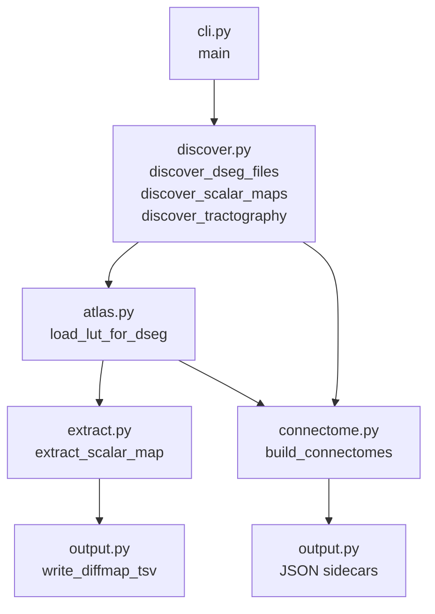

# API Reference

QSIParc is organised as a small set of focused modules. Each module has a single responsibility and exposes a clean public interface.

## Module overview

```
qsiparc/
├── cli.py        # Click command-line entry point
├── discover.py   # BIDS file discovery and entity parsing
├── atlas.py      # Atlas LUT loading and region metadata
├── extract.py    # Per-region scalar extraction (numpy masking)
├── connectome.py # tck2connectome subprocess wrapper
└── output.py     # BIDS-derivative TSV/JSON writing
```

## Data flow



## Key types

| Type | Module | Description |
|------|--------|-------------|
| `BIDSFile` | `discover` | A discovered file with parsed BIDS entities |
| `AtlasDsegFile` | `discover` | Atlas dseg NIfTI paired with its LUT path |
| `RegionInfo` | `atlas` | Immutable metadata for one atlas region |
| `AtlasLUT` | `atlas` | Ordered container of `RegionInfo` objects |
| `ExtractionResult` | `extract` | Scalar name + atlas name + stats DataFrame |
| `ConnectomeResult` | `connectome` | Connectivity matrix + full provenance |
| `DiffmapProvenance` | `output` | Provenance metadata for a diffmap TSV |

## Module pages

- [discover](discover.md) — File discovery and BIDS entity parsing
- [atlas](atlas.md) — Atlas LUT loading
- [extract](extract.md) — Scalar extraction
- [connectome](connectome.md) — Connectivity matrix construction
- [output](output.md) — Output writing
