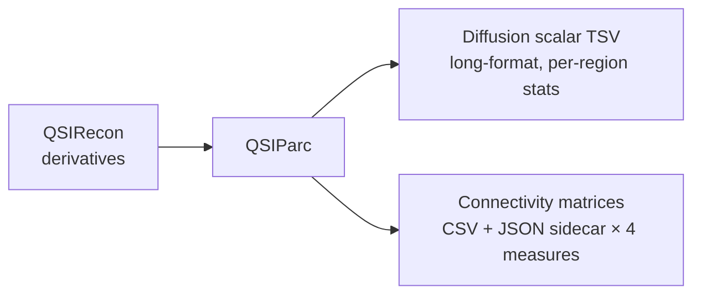

# QSIParc

**Parcellated diffusion feature extraction and structural connectome construction from [QSIRecon](https://qsirecon.readthedocs.io/) outputs.**

QSIParc is one half of the [SNBB](https://github.com/snbb) neuroimaging feature extraction stack, paired with **fsatlas** (FreeSurfer morphometrics). It reads atlas parcellations and diffusion scalar maps produced by QSIRecon, computes per-region distribution statistics, builds structural connectivity matrices, and writes analysis-ready outputs in a BIDS-derivative layout.

---

## What QSIParc does



### Scalar extraction

For each atlas region and each diffusion scalar map (FA, MD, ICVF, RD, AD, MAPMRI, DKI, …), QSIParc computes:

| Statistic | Description |
|-----------|-------------|
| `mean` | Arithmetic mean across voxels |
| `median` | Median |
| `std` | Standard deviation |
| `iqr` | Interquartile range |
| `skewness` | Pearson skewness |
| `kurtosis` | Excess kurtosis |
| `n_voxels` | Number of valid (non-NaN) voxels |
| `coverage` | Fraction of atlas-defined voxels with signal |

Results are stacked into a single **long-format TSV** per atlas per session — easy to filter and join in any data analysis tool.

### Structural connectomes

For each tractogram × atlas pair, QSIParc runs `tck2connectome` (MRtrix3) with four standardised measure variants and packages each result as a symmetric N×N CSV plus a JSON sidecar with full provenance.

---

## Quick start

```bash
pip install qsiparc

# Extract all atlases, all subjects
qsiparc /data/qsirecon /data/qsiparc-out -v

# Single subject, single atlas
qsiparc /data/qsirecon /data/qsiparc-out \
    --participant-label sub-001 \
    --atlas Schaefer2018N100Tian2020S2

# Dry run: see what would be processed
qsiparc /data/qsirecon /data/qsiparc-out --dry-run
```

---

## Key design decisions

!!! info "No atlas warping"
    QSIRecon already places atlas parcellations in subject diffusion space.
    QSIParc consumes them directly — no registration step.

!!! info "Direct numpy masking"
    Per-region voxel arrays are extracted with numpy masks rather than nilearn's
    `NiftiLabelsMasker`, giving access to full voxel distributions for all
    higher-order statistics.

!!! info "Long-format output"
    One TSV per atlas per session, all scalars stacked by row. Downstream
    analysis with pandas, R, or any other tool is a single `pd.read_csv` away.

!!! info "Graceful MRtrix3 fallback"
    Scalar extraction works without MRtrix3. Connectome construction is silently
    skipped with a warning if `tck2connectome` is not on `$PATH`.

---

## In scope / out of scope

| In scope | Out of scope |
|----------|-------------|
| Parcellated diffusion scalar maps | FreeSurfer surface metrics (use `fsatlas`) |
| Structural connectivity matrices (4 variants) | Atlas warping/registration |
| QSIRecon built-in atlas set | Tractography reconstruction |
| BIDS-derivative output layout | Any QSIRecon processing step |
| Long-format TSV + JSON sidecar | |

---

## Citation

If you use QSIParc in a publication, please cite it via the repository:
[https://github.com/GalKepler/qsiparc](https://github.com/GalKepler/qsiparc)
