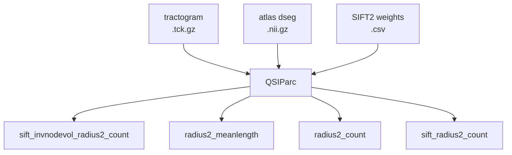

# Connectivity Matrices

QSIParc constructs structural connectivity matrices from QSIRecon's tractography outputs using MRtrix3's `tck2connectome`. This page describes the four measures, the required inputs, and the output format.

## Overview

QSIRecon produces tractography (`.tck.gz`) and SIFT2 streamline weights, but does **not** run `tck2connectome`. Connectome construction is entirely QSIParc's responsibility.

For each tractogram × atlas combination, QSIParc runs four `tck2connectome` calls, each producing a symmetric N×N CSV matrix plus a JSON sidecar with full provenance.



## The four measures

### `sift_invnodevol_radius2_count`

SIFT2-weighted streamline count, normalised by inverse node volume. This is the recommended measure for comparing connectivity across regions of different sizes.

**tck2connectome flags:**
```bash
tck2connectome <tck> <dseg> <out.csv> \
    -assignment_radial_search 2 \
    -scale_invnodevol \
    -symmetric \
    -stat_edge sum \
    -tck_weights_in <sift2_weights.csv>
```

**Requires:** SIFT2 weights

---

### `radius2_meanlength`

Mean streamline length per edge. Useful for characterising the physical distance of structural connections.

**tck2connectome flags:**
```bash
tck2connectome <tck> <dseg> <out.csv> \
    -assignment_radial_search 2 \
    -scale_length \
    -symmetric \
    -stat_edge mean
```

**Requires:** Nothing additional

---

### `radius2_count`

Raw streamline count. No SIFT2 weighting, no normalisation. Useful as a baseline or for comparison with SIFT2-weighted measures.

**tck2connectome flags:**
```bash
tck2connectome <tck> <dseg> <out.csv> \
    -assignment_radial_search 2 \
    -symmetric \
    -stat_edge sum
```

**Requires:** Nothing additional

---

### `sift_radius2_count`

SIFT2-weighted streamline count without node-volume normalisation. Complements `sift_invnodevol_radius2_count` when you want to preserve absolute counts.

**tck2connectome flags:**
```bash
tck2connectome <tck> <dseg> <out.csv> \
    -assignment_radial_search 2 \
    -symmetric \
    -stat_edge sum \
    -tck_weights_in <sift2_weights.csv>
```

**Requires:** SIFT2 weights

---

## Flag reference

| Config shorthand | MRtrix3 flag | Description |
|-----------------|--------------|-------------|
| `search_radius: 2` | `-assignment_radial_search 2` | 2 mm radial search radius for streamline endpoint assignment |
| `scale_invnodevol: true` | `-scale_invnodevol` | Scale edge weights by inverse node volume |
| `length_scale: length` | `-scale_length` | Scale each streamline contribution by its length |
| `use_sift_weights: true` | `-tck_weights_in <file>` | Apply SIFT2 streamline weights |
| `symmetric: true` | `-symmetric` | Symmetrise the output matrix |
| `stat_edge: sum` | `-stat_edge sum` | Sum contributions across streamlines per edge |
| `stat_edge: mean` | `-stat_edge mean` | Average contributions per edge |

## MRtrix3 dependency

Connectome construction requires MRtrix3 (`tck2connectome`) on `$PATH`. QSIParc checks at startup:

- If MRtrix3 is **found**: connectomes are built for all subjects.
- If MRtrix3 is **not found**: a warning is printed and connectome construction is skipped. Scalar extraction continues normally.

```
WARNING tck2connectome not found on PATH — connectome construction will be skipped.
         Install MRtrix3 to enable this feature.
```

## SIFT2 weights discovery

QSIParc looks for SIFT2 weight files **adjacent to the tractogram** (same directory):

```
*_streamlineweights.csv
*_siftweights.csv
```

If no weight file is found, the two SIFT2-requiring measures (`sift_invnodevol_radius2_count` and `sift_radius2_count`) are skipped with a per-tractogram warning. The unweighted measures still run.

## Handling compressed tractograms

MRtrix3 does not accept `.tck.gz` files directly. QSIParc automatically decompresses the tractogram to a temporary `.tck` file, runs all four `tck2connectome` calls, then deletes the temporary file. This happens transparently.

## Output files

For each tractogram × atlas pair, up to eight files are written (CSV + JSON per measure):

```
atlas-{name}/
├── sub-001_ses-01_{tck_entities}_atlas-{name}_desc-sift_invnodevol_radius2_count_connmatrix.csv
├── sub-001_ses-01_{tck_entities}_atlas-{name}_desc-sift_invnodevol_radius2_count_connmatrix.json
├── sub-001_ses-01_{tck_entities}_atlas-{name}_desc-radius2_meanlength_connmatrix.csv
├── sub-001_ses-01_{tck_entities}_atlas-{name}_desc-radius2_meanlength_connmatrix.json
├── sub-001_ses-01_{tck_entities}_atlas-{name}_desc-radius2_count_connmatrix.csv
├── sub-001_ses-01_{tck_entities}_atlas-{name}_desc-radius2_count_connmatrix.json
├── sub-001_ses-01_{tck_entities}_atlas-{name}_desc-sift_radius2_count_connmatrix.csv
└── sub-001_ses-01_{tck_entities}_atlas-{name}_desc-sift_radius2_count_connmatrix.json
```

`{tck_entities}` contains the BIDS entities from the tractogram filename (excluding `sub` and `ses`), allowing disambiguation when multiple tractograms exist in the same session.

See [Output Format](outputs.md) for details on the CSV and JSON sidecar schemas.
